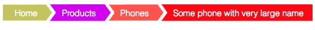

# D3 breadcrumbs

## See the [Project Page](https://bumbeishvili.github.io/d3-breadcrumbs/) for interactive example!

## screenshot

### History 
I was tired copying same thing over and over in different projects and decided to create small lib for breadcrumbs

### Highlights
* Dynamic resizing
* Support of breadcrumbs wrapping
* High number of customization options

### Usage
1. Include `breadcrumb.js` file into you app

```html
 <script src="breadcrumb.js"></script>
```
2. Initialize breadcumb inside your d3 visual

```javascript
  var breadcrumb = d3.breadcrumb()
          .container('svg')   // any element or selection 
```

3. Show or hide it on your events
```javascript
//show
breadcrumb.show([
  {text:"Hi"},
  {text:"I am breadcrumb"}
])
```

```javascript
//hide
breadcrumb.hide()
```


## Author
 [David   B (twitter)](https://twitter.com/dbumbeishvili)  
 [David   B (linkedin)](https://www.linkedin.com/in/bumbeishvili/)  

I am available for freelance data visualization work. Please [contact me](https://davidb.dev/about) in case you'd like me to help you with my experience and expertise

You can also [book data viz related consultation session](https://www.fiverr.com/share/4XxG21) with me
